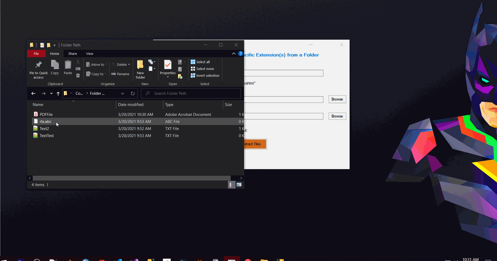

# V1.0 is Out
## Working Demo V1.0

# SP-WinFormsCS-ExtractFiles V1.1
### Extract Files of Specific Extension from Folder.

## Upcoming Features in V1.1
* Radio Button options to Move or Copy Files
* Checkbox button option to include Sub Folders or not

## Bugs in V1.0
- If the destination directory contains file with the same name then the program throws an exception
